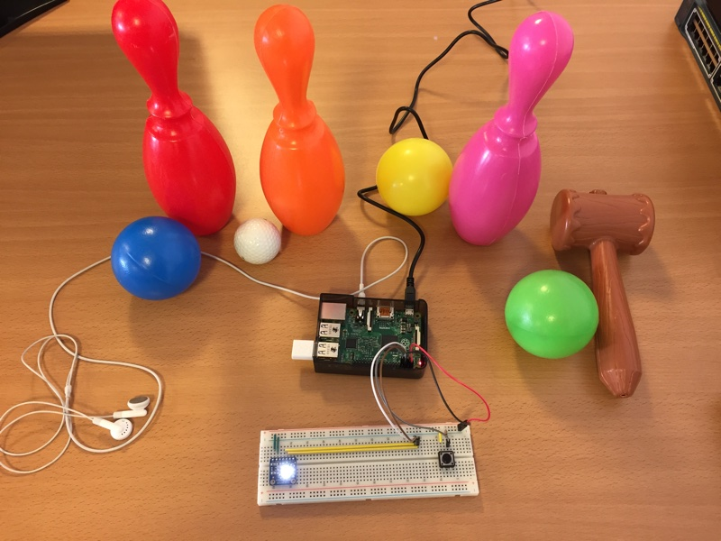
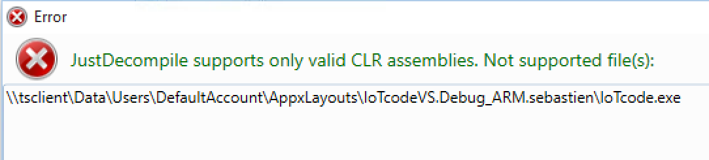
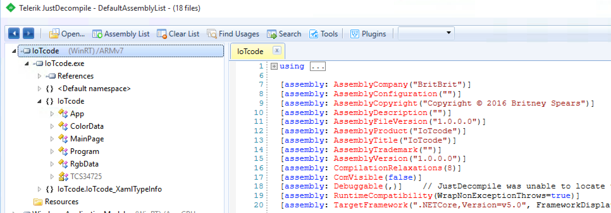

## Infos

**Author**: Britney
**Category**: Hardware
**Difficulty**: Medium

## Description

Here is a compressed copy of the user partition of a Windows 10 Core IoT running on a Raspberry Pi 2 (inside `raspberry2_partition_Data.zip`). Find what you have to do and test your answer with the Raspberry Pi on the desk of the organizers.



The flag is in the form `INS{something in small caps}`

Notes:

- You have to validate the code with the Raspberry Pi on the desk of the organizers because the flag is slightly different from the version in the executable you have.

- This challenge was prepared by Tom, 12 years old (my son).

## Solution

The zip file contains a single file:

```
$ unzip raspberry2_partition_Data.zip
Archive:  raspberry2_partition_Data.zip
  inflating: raspberry2_partition_Data

$ file raspberry2_partition_Data
raspberry2_partition_Data: x86 boot sector; partition 1: ID=0x72, starthead 13, startsector 1920221984, 1816210284 sectors, code offset 0x52, OEM-ID "NTFS    ", sectors/cluster 32, reserved sectors 0, Media descriptor 0xf8, heads 255, hidden sectors 1920, dos < 4.0 BootSector (0x80)
```  

We can mount this image. For example, on Mac OS X:

```
$ sudo hdiutil attach -imagekey diskimage-class=CRawDiskImage raspberry2_partition_Data

$ cd /Volume/Data
$ ls -l
drwxrwxrwx  1 scrt  staff   189B Oct 30 13:46 EFI/
-rwxrwxrwx  1 scrt  staff     0B Oct 30 03:17 FirstBoot.Complete*
drwxrwxrwx  1 scrt  staff   189B Oct 30 13:46 Program Files/
drwxrwxrwx  1 scrt  staff   189B Oct 30 13:46 Program Files (x86)/
drwxrwxrwx@ 1 scrt  staff   441B Oct 30 03:17 ProgramData/
drwxrwxrwx  1 scrt  staff   189B Oct 30 13:46 Programs/
drwxrwxrwx  1 scrt  staff   189B Oct 30 13:46 SharedData/
drwxrwxrwx@ 1 scrt  staff   189B Mar 11 00:34 System Volume Information/
drwxrwxrwx  1 scrt  staff   315B Mar 11 00:33 SystemData/
drwxrwxrwx  1 scrt  staff   441B Mar 11 00:33 Users/
drwxrwxrwx  1 scrt  staff   441B Oct 30 13:47 Windows/
drwxrwxrwx  1 scrt  staff   189B Oct 30 13:47 test/
```

Windows 10 IoT applications are stored in the folder `Users/DefaultAccount/AppxLayouts/`:

```
$ ls -l Users/DefaultAccount/AppxLayouts/

total 64
drwxrwxrwx  1 scrt  staff   7.3K Mar 11 00:39 IoTcodeVS.Debug_ARM.sebastien/
drwxrwxrwx  1 scrt  staff   693B Mar 11 00:47 IoTcodeVS.Release_ARM.sebastien/
```

Looks like we have both Release and Debug versions of the application! Lets look at the Debug one. It is probably easier to reverse.

```
$ ls -l Users/DefaultAccount/AppxLayouts/IoTcodeVS.Debug_ARM.sebastien/*.exe

-rwxrwxrwx  1 scrt  staff   9.5K Mar 11 00:38 Users/DefaultAccount/AppxLayouts/IoTcodeVS.Debug_ARM.sebastien/IoTcode.exe
```

We have an executable. If we look at it with a decompiler (such as Telerik JustDecompile, only available on Windows), we get:



Damned! Do we have to decompile the ARM executable with a tool such as IDA or Hopper? No. This simply not the right executable but a launcher. The right one is in the `entrypoint` folder. Open `/entrypoint/IoTcode.exe` in JustDecompile: 



Under MainPage, you have interesting function members like "verifyCode". If you decompile it, you obtain almost the original source code (without comments of course):

```C#
private async Task verifyCode(String colorRead)
{
    if (String.Compare(colorRead, this.code[this.codeIndex], true) == 0)
    {
        Int32 num = this.codeIndex + 1;
        this.codeIndex = num;
        if (num != (Int32)this.code.Length)
        {
            await this.SpeakColor(colorRead, "");
        }
        else
        {
            this.codeIndex = 0;
            await this.SpeakColor(colorRead, String.Concat("You have the right code, congratulations.", this.GetFlag(), this.GetFlag()));
        }
    }
    else
    {
        this.codeIndex = 0;
        await this.SpeakColor(colorRead, "You have the wrong code");
    }
}
```

It is called from `buttonPin_ValueChanged`:

```C#
private async Task verifyCode(String colorRead)
{
    if (String.Compare(colorRead, this.code[this.codeIndex], true) == 0)
    {
        Int32 num = this.codeIndex + 1;
        this.codeIndex = num;
        if (num != (Int32)this.code.Length)
        {
            await this.SpeakColor(colorRead, "");
        }
        else
        {
            this.codeIndex = 0;
            await this.SpeakColor(colorRead, String.Concat("You have the right code, congratulations.", this.GetFlag(), this.GetFlag()));
        }
    }
    else
    {
        this.codeIndex = 0;
        await this.SpeakColor(colorRead, "You have the wrong code");
    }
}
```

In plain english, when you press on the button (down edge), it reads the color and it calls `verifyCode`. This member function compares the recognized color with an array (`code`), more specifically with the color at position `codeIndex`. If the color is correct, it calls `SpeakColor`. If all the colors in `code` have been recognized, it calls `GetFlag` (two times). If the color is wrong, is says "You have the wrong code".

So all we have to do is to find how `code` is initialized:

	private String[] code = new String[] { "red", "red", "blue", "white", "yellow" }; 

But if you try this sequence, it does not work. This is because "code" is later modified:

```C#
public MainPage()
{
    this.InitializeComponent();
    this.code[1] = this.code[3];
    this.code[3] = this.code[4];
    this.code[4] = this.code[0];
}
```

The code is thus: red, white, blue, yellow, red and the flag is:

	INS{red_white_blue_yellow_red}

In the actual Raspberry Pi (on the desk of the organizers), the challenge was slightly modified so you have to validate the code on the actual device. There were toys of different colors around the Rapsberry and the application was calibrate to recognize their colors. When you find the right code, the speech synthesizer recite the lyrics of the song "Oops! ...I Did It Again" and then gives the flag:

	INS{red_white_blue_yellow_red_britney}

_**Note**: Some decompilers such as dotPeek are not decompiling the executable properly: it forgets to decompile the initialization of `code`!_

_The code of this challenge was based on a Windows IoT sample [https://www.hackster.io/windows-iot/what-color-is-it-578fdb](https://www.hackster.io/windows-iot/what-color-is-it-578fdb)_

